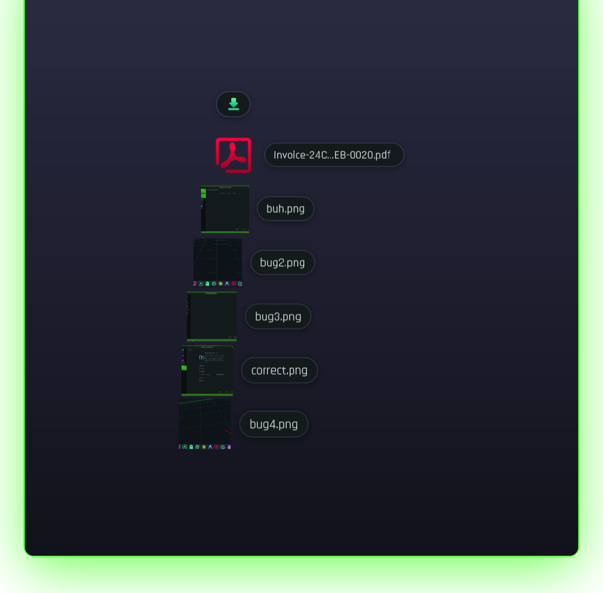
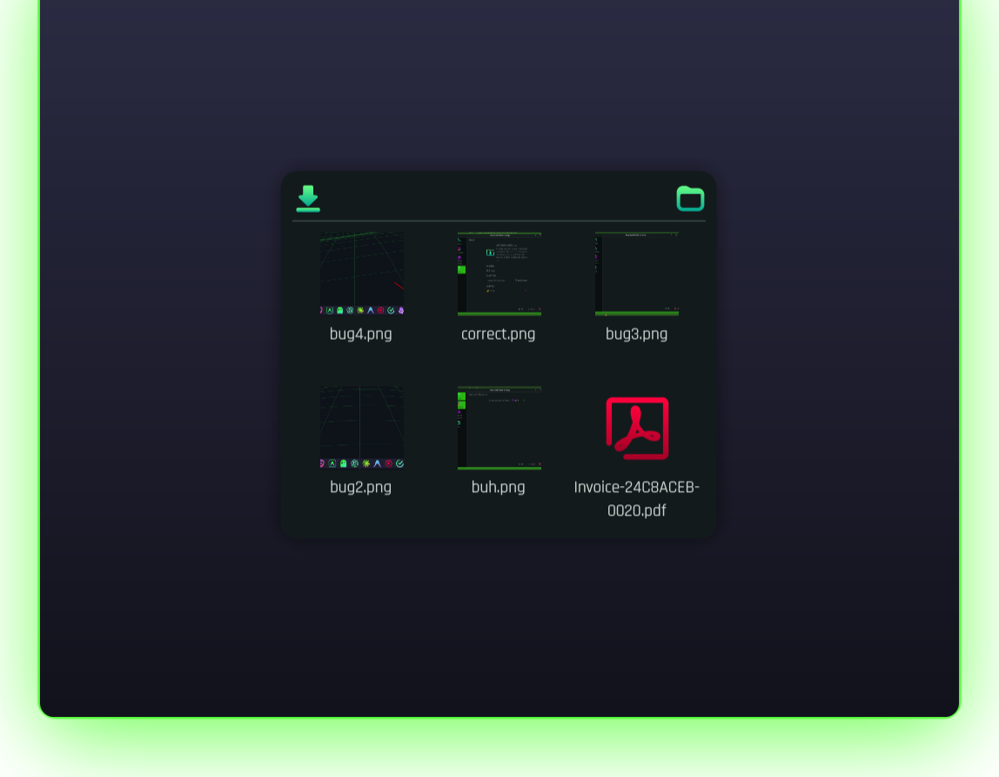
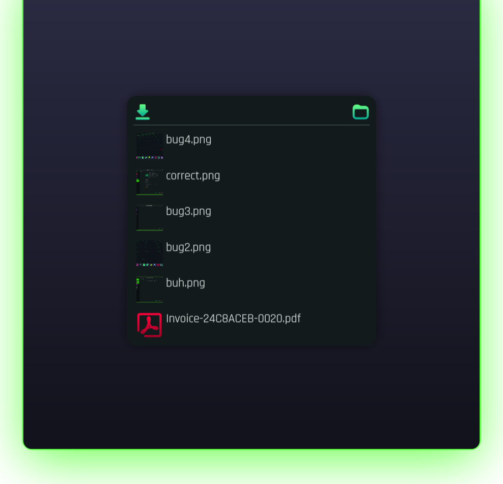

# Downloads Stack for KDE Plasma 6

A Plasma 6 widget that brings the **macOS Dock "Downloads stack"** to KDE. A little
pile icon sits in your panel; click it and your most recent downloads pop out — as a
**Fan**, a **Grid**, or a **List**. Drag any file straight into another app, click to
open it, or jump to the folder.

<p align="center">
  
</p>

| Fan | Grid | List |
| :---: | :---: | :---: |
|  |  |  |

## Install

**One-liner** (downloads and installs for your user — no root needed):

```sh
curl -fsSL https://raw.githubusercontent.com/cromewar/plasma-downloads-stack/main/install.sh | sh
```

Then **right-click your panel → Add Widgets… → search "Downloads Stack"** and drop it
on your panel. For the most macOS-like feel, use a bottom panel/dock so the fan opens
upward.

> If it doesn't appear right away, restart the shell once:
> `systemctl --user restart plasma-plasmashell.service`

<details>
<summary>Manual install (from a clone)</summary>

```sh
git clone https://github.com/cromewar/plasma-downloads-stack.git
cd plasma-downloads-stack
./install.sh          # or: kpackagetool6 --type Plasma/Applet --install package
```
</details>

## Features

- **Three views**, switchable in settings:
  - **Fan** — a curved stack that arcs up from the icon, newest nearest, floating
    frameless over the desktop. Names auto-flip to the side that keeps the icons above
    the panel icon (like the macOS stack near a screen edge).
  - **Grid** — thumbnails with names underneath, on a tidy card.
  - **List** — one file per row with its icon, name and kind.
- **Live** — new downloads appear at the front automatically.
- **Real thumbnails** for images; file-type icons for everything else.
- **Drag out** to any app (Dolphin, browsers, chat, editors…) — a standard
  `text/uri-list` file drag.
- **Click** a file to open it, or use the header/chip to open the folder.
- **Panel icon** shows the newest download and a count badge — or a plain folder icon,
  your choice. Hover it for the newest file's name.
- Sort by **date, name, size or type**, ascending or descending.
- Follows your **Plasma theme** (light and dark) and icon set.

## Settings

Right-click the widget → **Configure Downloads Stack…**

**General** — Downloads folder (defaults to your XDG Downloads folder), how many files
to show, sort by (date / name / size / type) and order, show hidden files.

**Appearance** — view (Fan / Grid / List), icon size, grid columns, panel-icon style
(stack of recent files vs. plain folder icon), and the item-count badge.

## Requirements

- KDE Plasma 6 (developed on 6.7)
- Qt 6

Pure QML — no compilation, installs per-user.

## Uninstall

```sh
kpackagetool6 --type Plasma/Applet --remove com.cromewar.downloadsstack
```

## Development

```
package/
  metadata.json
  contents/
    config/        # settings schema (main.xml) + ConfigModel (config.qml)
    ui/
      main.qml         # plasmoid: compact "pile" icon, live model, popup dialog
      FanMode.qml      # fan view      GridMode.qml   # grid view
      ListMode.qml     # list view     FileTile.qml   # animated fan tile
      FileDragItem.qml # reusable click + drag-out wrapper
      FileThumb.qml    # image thumbnail / mime icon
      IconTools.js     # extension → icon name / kind
      ConfigGeneral.qml / ConfigAppearance.qml   # settings pages
```

After editing, reinstall and reload the shell:

```sh
kpackagetool6 --type Plasma/Applet --upgrade package
systemctl --user restart plasma-plasmashell.service
```

### Notes for hackers

- Qt 6's `FolderListModel` URL role is **`fileUrl`** (Qt 5's `fileURL` is gone).
- `sortField: Time` sorts the *opposite* way from the other fields, so the code inverts
  `sortReversed` for date sorting.
- A Plasma applet **must** define a `fullRepresentation`, or the shell renders neither
  representation — even a panel-only, icon-only widget.
- Config **pages** (`ConfigGeneral.qml`, `ConfigAppearance.qml`) live in
  `contents/ui/` — a `ConfigCategory`'s `source:` is resolved relative to `ui/`, not
  `config/`.

## License

[GPL-3.0-or-later](LICENSE). Contributions welcome.
